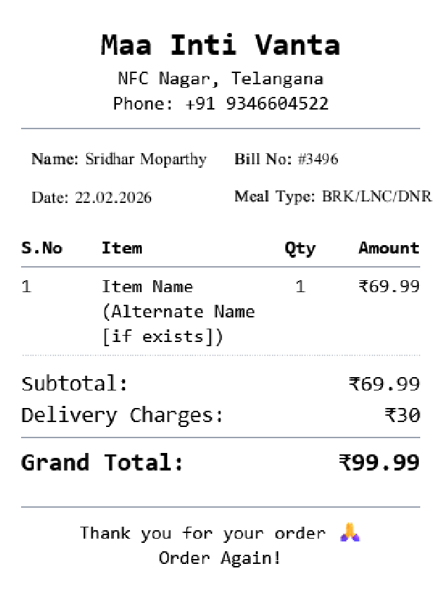
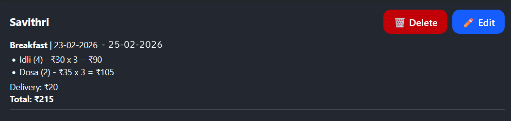

# MIV Core - A Business Facing Application for Business Management
MIV Core is a business facing **mobile first** app for our small scale cloud kitchen with customering around 20 to 30.
The following is the documentation that specifies what are the expectations for the application, user flows, expected feature and more.

## Core Features
### 1. Roles
There are currently two types of users that can access the application:
* Admin
* Courier

#### Admin:
Can access the entire application and execute all flows

#### Courier:
Can access delivery module only, can view orders and select orders for delivery to access payment and item information.

### 2. Dashboard
The landing page/first page/home page of the application. Allows users to access various modules within the application to execute various flows.

### 3. Menu Creator
- Users can create menus here.
- Has a date input field for creating a menu for that particular date.
- When user selects a date, 3 sections appear, "Breakfast", "Lunch" and "Dinner". These are called **Meal Types**
- From the database the items are fetched and the user can see items for the corresponding Meal Type under the Meal Type section's dropdowns.
- Selecting an item from the dropdown will show that they are being added for the Meal Type live in the UI.
- User can delete the item too
- Each section has dropdown input fields.
    - Breakfast only has one field, where they can only select from breakfast items.
    - Lunch and Dinner have inputs fields as:
        - Select daal
        - Select curry
        - Select pickle
        - Select sambar
        - Select others 
- After items are added for Meal Types, users can then proceed to generate the menu.
- This menu is stored in the database as well as temporarily in the frontend
- Along with that, a [Whatsapp formatted message](#whatsapp-message-format)  is also generated for the user to copy-paste it in Whatsapp.

### - Edit Inventory
- When the user is inside the [Menu Creator](#3-menu-creator), they have access to a feature through button called "Edit Inventory"
- Clicking on it opens up a modal that allows user to Create, Update and Delete items under three different **Meal Types**
- Each entry is called a **Meal Item**
- A Meal Item has a name, price and an alternate name (for future langauge expansion) 

### Billing Module
- User selects a date
- Only after selection of date the user can see the select customer section
- User can select a customer using a searchable dropdown
- User can create a customer even before they select a date.
- After selecting a customer from dropdown options, user can see other options like "Select Meal" dropdown that shows **Meal Types** - Breakfast, Lunch and Dinner
- When a **Meal Type** is selected from the dropdown, the UI shows the items that are added in the Menu for the particular date 
- All the items for that **Meal Type** are shown in the UI but with 0 quantity.
- User can increament the items that the customer wants.
- A dynamic HTML based bill is generated below in real-time that looks as follows:

- User can even change the **Meal Type** by using the Meal Type dropdown, changing a meal type will cause a reset for the items that were incremented in the previous meal type. Example, user initially selects meal type as "Breakfast", all breakfast items that were created as part of the menu for the selected date are shown with quantity defaulted to 0. The user increments items, say "Idly (4)" and "Dosa" with quantity of each as '2'. Now the user decides to switch to "Lunch" Meal Type using the dropdown which is right now set to "Breakfast", the user is prompted to confirm this change as changing the Meal Type after a meal type is already selected will reset all the increments that they have made, i.e., "Idli (4)" and "Dosa" will be reset back to 0 and Lunch menu items that were created for that date are shown with with 0 default quantity.
- Another section called "Delivery" is also shown where the user can set the delivery mode, the delivery modes and their pricing are:
    - No delivery - no price
    - Within 3km - 30rs
    - Beyond 3km - 60rs
    - Custom - input field (takes only number)
- These are radio buttons, only one can be selected at a time, where **Within 3km** is selected by default
- The create customer button will open up a modal that takes the following inputs:
    - Customer Name - String
    - Phone Number - Long integer
    - Address - String
    - Create button
    - Cancel button
- User can clear the entire changes like quantity changes, customer selected, date etc. using the clear button. Basically making the page fresh, no data entered by user.

### Customer Management Module
- User can create, edit, delete and view customers
- User can also search customers using a search bar
- Customers are shown in list order with each of them having an option to delete and edit them.

### Order History Module
- User selects a date range 
- Only after date range is selected a Grand Total is shown
- Grand total is the sum of price of all orders by all customers.
- Along with Grand total, we can see breakfast, lunch and dinner totals for that date range.
- User can also search for customers and see the totals for that specific customer.
- The customer specific total can look like this:

### Dashboard Module
- User selects a date to view the dashboard
- Only on selection of a date the user can see the option to select the **Meal Type**
- On selection of **Meal Type** the user can see the following boards for the selected date.
- The items in these boards are the items that were added in the menu for that particular date.
- There are two types of boards:
    - Cooking : Shows only the items that needs to be cooked, users can strike off the items once they have done cooking that item. The items can be unstriked too, this is just for visual cues to keep track of progress and not change the database.
    - Packaging : Similar to cooking board, shows only the items that need to be packed, items that marked as completed (striked) in cooking, appear in the packaging board. These items can also be striked off to track progress

## Example Flows
### - Menu Creation - Create Menu
* **Role** : Admin
* **Preconditions** : 
    1. Admin is logged in
    2. Admin is inside Menu Creation page
* Steps : 
    1. User selects delivery date as 12/02/2026 from date picker
    2. Three sections appear on page below deivery date field, they are "Breakfast", "Lunch" and "Dinner".
    3. User clicks on "Select Item" searchable dropdown, and searches for "idli"
    4. The dropdown shows items with string "idli" in it like "Ragi Idli (4)", "Idli (4)", etc.
    5. User clicks on "Idli (4)" dropdown option
    6. "Idli (4)" is shown as added to breakfast menu 
    7. User clicks on Lunch menu
    8. Input fields to select lunch items are shown.
    9. User clicks on the "Select Daal" searchable dropdown input field and searches for "Mango".
    10. The dropdown options show daal items with string "mango" in it, like "Mango Daal","Mango Spinach Daal" etc.
    11. User clicks on "Mango Daal"
    12. "Mango daal" is shown as added in Lunch Menu in the UI  
    13. User removes the entered text in the searchable dropdown input field and enters "Beerakaya"
    14. The dropdown options show only daal items with string "Beerakaya" in it, like "Beerakaya Daal".
    15. User clicks on "Beerakaya Daal" from the options
    16. Now both "Beerakaya Daal" and "Mango Daal" are shown in the Lunch menu UI.
    17. Same flow as daal item for other dropdowns like "curry", "pickle", "sambar" and "others"
    18. The categories like "daal", "curry", "pickle", etc. are structurally stored in the database.
    19. User clicks on "generate menu"
    20. A copy-paste ready Whatsapp message is shown with a copy to clipboard feature.

### - Menu Creation - Inventory Edit
* **Role** : Admin
* **Preconditions** : 
    1. Admin is logged in
    2. Admin is inside Menu Creation page
* Steps : 
    1. User clicks on Inventory Edit button
    2. A modal shows up with three sections - "Breakfast", "Lunch", "Dinner"
    3. User clicks on add button
    4. An empty entry is added, the empty entry has 3 input fields - "Item Name", "Alternative Name" (for future language expansion), and "Price"
    5. User enters Item name as "Aloo Masala", alternate name is optional, so user leaves it empty, price is a number only field, hence enters a number 40.00
    6. All **Meal Items** are editable by default and can be deleted using a button in the same row.
    7. User clicks on "Lunch" menu 
    8. Same flow for "Lunch" and "Dinner" sections
    9. User can save the Inventory for Breakfast, Lunch and Dinner individually.

### Customer Management - Customer Creation
* **Role** : Admin
* **Preconditions** : 
    1. Admin is logged in
    2. Admin is inside Customer Management page
* Steps : 
    1. User clicks on "Add" button
    2. A modal pops up showing the input fields Customer Name, Phone Number and Address
    3. User enters name as "Sridhar Moparthy", Phone Number as '6281593910' and Address as "Hno A-31, NFC Nagar, Ghatkesar"
### Customer Management Module - Customer Search
* **Role** : Admin
* **Preconditions** : 
    1. Admin is logged in
    2. Admin is inside Menu Creation page
* Steps : 
    1. User clicks on the search bar and searchs for customer name "Sridhar Moparthy"
    2. The results show customer named "Sridhar Moparthy" with their phone number and address data.

### Customer Management Module - Customer Edit and Delete
* **Role** : Admin
* **Preconditions** : 
    1. Admin is logged in
    2. Admin is inside Menu Creation page
* Steps : 
    1. User clicks on the three dot menu corresponding to the Customer "Sridher Moparthy"
    2. Options are shown which include "Edit" and "Delete"
    3. User clicks on "Edit" button and a modal pops up which is same as the "Create Customer" modal with Customer Name, Phone Number and Address.
    4. The existing Customer Name, Phone Number and Address are shown in the input fields.
    5. User changes the name from "Sridher Morparthy" to "Sridhar Moparthy"
    6. Clicks on Save
    7. For delete, the user clicks on "Delete" option from three dots.
    8. User is prompted to message asking for confirmation, confirming deletes the customer.

## Dependencies
### Whatsapp Message Format
*Date: 18th  Feb 2026*

*Breakfast*☀️ 

- Idli (4) - ₹30
- Dosa (2) - ₹35
- Onion Dosa (2) - ₹40

*Lunch*🍜 

- Mamidikaya Pappu - ₹30
- Carrot curry  - ₹30
- Potlakaya perugu pachadi - ₹20
- Rice  - ₹30
- Chapati - ₹8
- Curd (100ml) - ₹10
- Jonna Rotte (Soft) - ₹10

*Dinner*🌙 
- Capsicum masala curry  - ₹70
- Chapati - ₹8
- Jonna Rotte (Soft) - ₹10
- Rice  - ₹30
- Curd (100ml) - ₹10

📦 *Delivery Charges:*
Upto 3 KM – ₹30
3 KM - 6 KM – ₹60

Thank You!